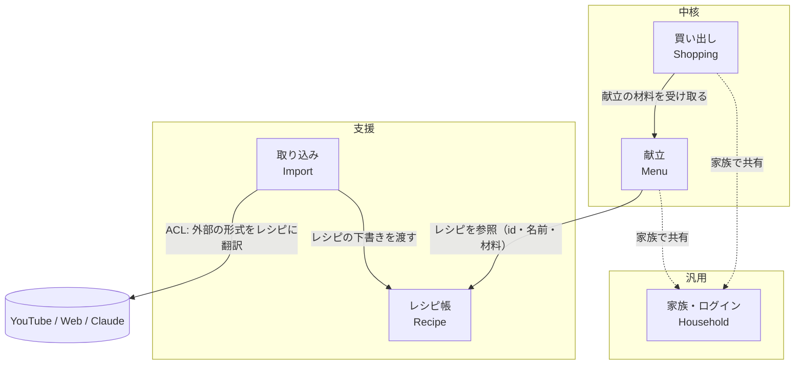

# コンテキストマップ（仮）

同じ言葉でも意味が変わる境目で領域を分ける。例えば「材料」は、レシピ帳では「レシピに書かれた分量」、買い出しでは「スーパーで買う物」になる。

| コンテキスト | 種類 | 責務 | 現在のコード |
|---|---|---|---|
| 献立 | 中核 | 食事ごとに何を食べるかを決める。多めに作る・残り物 | `meal_plans` テーブル、`meal-calendar.tsx` |
| 買い出し | 中核 | 家族で共有する買い物リスト。足し引き・チェック | 永続化されていない（`shopping.ts` で毎回計算、チェックは端末ごと） |
| レシピ帳 | 支援 | レシピの保存・編集・検索・削除 | `recipes` テーブル、`recipe-form.tsx` など |
| 取り込み | 支援 | 外部の情報をレシピの下書きに変換する（腐敗防止層） | `src/lib/import/` |
| 家族・ログイン | 汎用 | 誰が使えるか | Supabase Auth、`members` テーブル |

## 中核に選んだ理由

レシピの保存や取り込みは、ほかのレシピアプリにもある。この家族ならではの価値は「冷蔵庫の中身に合わせて献立と買う物を柔軟に足し引きし、2 人で分担して買い出しすること」にある。
