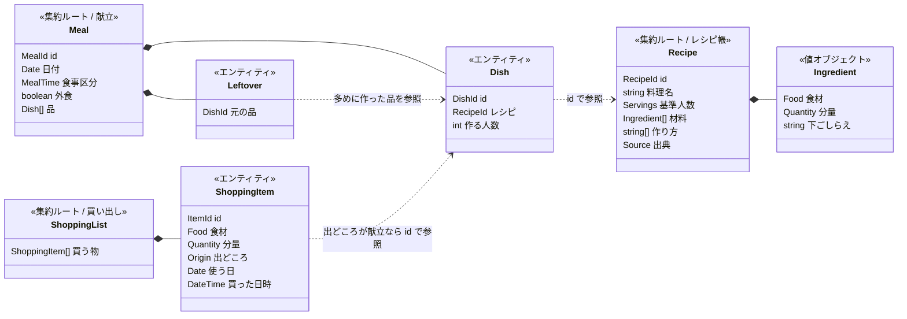

# ドメインモデル

集約（データの整合性を守る単位）と、必ず守られるべきルール（不変条件）をまとめる。
用語は [glossary.md](glossary.md) に従う。

## 全体像

## レシピ帳コンテキスト

### 集約: レシピ（Recipe）

| ルール | 内容 |
|---|---|
| R1 | 料理名は必須 |
| R2 | 材料の食材名は空にできない |
| R3 | 基準人数は取り込み時に「〇人分」「〇人前」の記載を探して設定する。見つからなければ 2 人分とみなし、画面で「人数の記載なし」と分かるようにする |
| R4 | レシピを削除すると、そのレシピを使った品は献立から消える |
| R5 | 当日以降の献立で使われているレシピを削除するときは、削除前に確認する |

### 値オブジェクト: 食材（Food）

- 店で買う物としての名前。**部位や種類は食材の一部**（豚ばら肉 ≠ 豚ロース肉）
- 下ごしらえ（みじん切り・薄切りなど）は食材に含めず、材料の別の項目として持つ
- 全角・半角や空白の違いは同じ食材とみなす
- 部位が書かれていない食材（豚肉）と部位が書かれた食材（豚ばら肉）は別の食材とみなす（どちらを買うか迷わないように）

### 値オブジェクト: 分量（Quantity）

- 「大さじ2」「200g」「1/2個」のように数えられる分量は、**人数に合わせて増減できる**
- 「少々」「適量」のように数えられない分量は、増減せずそのまま
- 同じ単位どうしは合算できる（大さじ2 ＋ 大さじ1 ＝ 大さじ3）。単位が違えば合算しない

## 献立コンテキスト

### 集約: 食事（Meal）

ある日の朝・昼・夜の 1 回分。献立はこの食事に並ぶ品の組み合わせ。

| ルール | 内容 |
|---|---|
| M1 | 日付と食事区分の組み合わせごとに、食事は 1 つ |
| M2 | 品は必ずレシピを参照する（バナナのようにレシピのない物は献立に入れない。必要なら買い物リストに直接足す） |
| M3 | 作る人数は 1 人以上。初期値は 2 人。カレーなど翌日も食べるときは増やす |
| M4 | 外食の食事には品を入れられない |
| M5 | 主菜・副菜・汁物の区別は持たない |
| M6 | 残り物は、それより前の食事で多めに作った（作る人数が 2 人より多い）品を参照する |
| M7 | 元の品が献立から外れたら、その残り物も外れる |
| M8 | 残り物は買い物を発生させない |
| M9 | 残り物は、献立に品を追加するときに「残り物」を選び、多めに作った品の中から選んで入れる |
| M10 | 残り物として献立に入っている品は、作る人数を 2 人分以下に減らせない（先に残り物を外す） |

## 買い出しコンテキスト

### 集約: 買い物リスト（ShoppingList）

家族で 1 枚だけ。ずっと使い続ける。

| ルール | 内容 |
|---|---|
| S1 | 家族で 1 枚。チェック状態も 2 人で共有する |
| S2 | 買う物の出どころは「献立の品」か「手で足した」のどちらか |
| S3 | 買った物は取り消し線で残り、翌日に自動で消える（押し間違えても当日中は戻せる）。買えなかった物は残り続ける |
| S4 | 冷蔵庫に合わせた足し引き（豚肉を消して鶏肉を足す等）はリスト上で行う。献立やレシピは変えない |
| S5 | 表示するときは、同じ食材・同じ単位の分量を合算し、どのレシピで使うかを添える。合算した行のチェックや削除は、まとめた買う物すべてに効く |
| S6 | 各行に使う日を表示し、「〇日以内に使う物」で絞り込める |
| S7 | 献立に入れた後でレシピの材料を手直ししても、すでにリストにある買う物は変わらない（必要なら手で足し引きする） |

## コンテキスト間のルール（ポリシー）

献立で起きたことに反応して、買い物リストを自動で更新する。

| きっかけ（献立のイベント） | 買い物リストの反応 |
|---|---|
| **品が献立に加わった** | レシピの材料を、作る人数に合わせて増減して買う物に加える（出どころ = その品） |
| **品が献立から外れた**（取りやめ・レシピ削除を含む） | その品が出どころの買う物のうち、まだ買っていない物を消す |
| **作る人数が変わった** | その品が出どころで、まだリストにある買う物の分量を新しい人数に合わせる。手で消した物は消えたまま |
| **外食になった** | 品がすべて外れるので、上と同じく買っていない物を消す |

## 今のコードとの差分

| 項目 | 今 | モデル |
|---|---|---|
| 献立のまとまり | `meal_plans` の 1 行 = 1 品。食事としてのまとまりがない | `meals`（食事）・`dishes`（品）・`leftovers`（残り物）に分けた |
| 作る人数 | なし（常にレシピの分量そのまま） | 品ごとに作る人数を持ち、分量を増減する |
| 外食 | 表せない | 食事に「外食」を持たせる |
| 残り物 | 表せない | 食事に残り物を並べられる（買い物は増えない） |
| 食材の名寄せ | 括弧書きを捨てて合算するため、豚ばら肉と豚ロース肉が混ざる | 食材と下ごしらえを分け、食材が同じものだけ合算する |
| 基準人数 | 文字列のまま。人数の計算に使えない | 数値で持ち、記載がなければ 2 人分とみなす |
| 買い物リスト | 保存されず、期間を選んで毎回計算。チェックは端末ごと | 家族で 1 枚を保存・共有。献立に合わせて自動で増減 |
| 手で足す物 | できない | できる |
| レシピ削除 | 確認なしで献立からも消える | 当日以降の献立で使われていれば確認する |
