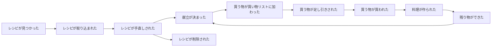

# イベントストーミング

家族の暮らしの中で起きる出来事（ドメインイベント）を時系列に並べたもの。
**太字**はドメインイベント、→ はきっかけになる操作、? は未確認の点。

## 大きな流れ

## レシピ帳

| ドメインイベント | きっかけ | 誰が | メモ |
|---|---|---|---|
| **レシピが取り込まれた** | YouTube / Web の URL を共有・貼り付け | 家族メンバー | AI が材料・作り方を読み取る |
| **レシピが手直しされた** | 読み取り結果や既存レシピを編集 | 家族メンバー | |
| **レシピが削除された** | 「もう作りたくない」 | 家族メンバー | 手軽にできること。記録は残さない。献立からも消える（当日以降の献立にあれば確認する） |

## 献立

| ドメインイベント | きっかけ | 誰が | メモ |
|---|---|---|---|
| **品が献立に加わった** | 日付と食事区分を選び、レシピを選ぶ | 家族メンバー（固定ではない） | 作る人数は初期値 2 人 |
| **作る人数が変わった** | カレーなど翌日も食べるので多めに作る | 家族メンバー | 人数はその都度変わる |
| **品が献立から外れた** | 予定変更・取りやめ | 家族メンバー | |
| **外食になった** | 外で食べる | 家族メンバー | 献立画面で外食と分かるようにする |
| **残り物が献立に加わった** | 前の日に多めに作った品を食べる | 家族メンバー | 「カレー（残り物）」と表示。買い物は増えない |

朝のバナナなど、その日の気分で決める物は献立に入れない（買い物リストに直接足す）。

## 買い出し

| ドメインイベント | きっかけ | 誰が | メモ |
|---|---|---|---|
| **献立の材料が買い物リストに加わった** | 「品が献立に加わった」に反応して自動で | システム | 作る人数に合わせて分量を増減する |
| **献立の材料が買い物リストから消えた** | 「品が献立から外れた」に反応して自動で | システム | まだ買っていない物だけ |
| **買う物が手で足された** | 牛乳・バナナ・代わりの食材など | 家族メンバー | |
| **買う物が消された** | 冷蔵庫にある・常備品・別の物で代用 | 家族メンバー | |
| **買う物が買われた** | 店でチェック | 買い出しに行った人 | 家族で共有。取り消し線で残り、翌日に自動で消える |
| **献立の材料の分量が変わった** | 「作る人数が変わった」に反応して自動で | システム | 手で消した物は消えたまま |

買い物リストは 1 枚をずっと使い続け、買えなかった物は残り続ける。

## 決まったこと

- 多めに作るときの人数は、その都度変わる（品ごとに「作る人数」を持つ）
- 材料の入れ替えは買い物リストの足し引きだけで行い、献立には残さない
- 買い物リストは家族で 1 枚。買った物は消え、買えなかった物は残る
- 献立を決めたら材料は自動でリストに入り、取りやめたら自動で消える
- レシピのない物（バナナ等）は献立に入れず、買い物リストに直接足す。外食は献立で分かるようにする
- 主菜・副菜・汁物の区別はしない
- レシピを削除したら献立からも消える。当日以降の献立で使われていれば、削除前に確認する
- 作る人数を変えたら、買い物リストの分量も自動で変わる
- 買った物は取り消し線で残り、翌日に自動で消える
- 同じ食材は合算して 1 行にする。ただし部位・種類が違えば別の食材（豚ばら肉 ≠ 豚ロース肉）
- 買う物には使う日を表示し、絞り込める
- 残り物は献立に表示する
- 基準人数は取り込み時に記載を探し、なければ 2 人分とみなす
- 残り物は、献立に品を追加するときに「残り物」を選び、多めに作った品から選んで入れる
- 部位が書かれていない食材（豚肉）と部位が書かれた食材（豚ばら肉）は別の行にする
- 献立に入れた後でレシピの材料を手直ししても、買い物リストはそのまま（必要なら手で足し引きする）

## 未確認の点（ホットスポット）

- なし（見つかったら追記する）
