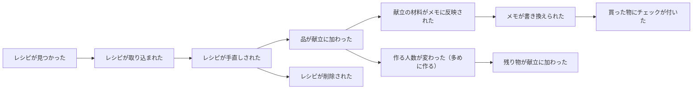

# イベントストーミング

家族の暮らしの中で起きる出来事（ドメインイベント）を時系列に並べたもの。
**太字**はドメインイベント。「コード」列はドメイン層で発生させているイベント名（ないものは、ユースケースや画面の操作として扱っている）。

## 大きな流れ

```mermaid
flowchart LR
  A[レシピが見つかった] --> B[レシピが取り込まれた]
  B --> C[レシピが手直しされた]
  C --> D[品が献立に加わった]
  D --> E[献立の材料がメモに反映された]
  E --> F[メモが書き換えられた]
  F --> G[買った物にチェックが付いた]
  D --> H[作る人数が変わった（多めに作る）]
  H --> I[残り物が献立に加わった]
  C --> J[レシピが削除された]
```

## レシピ帳

| ドメインイベント | コード | きっかけ | 誰が | メモ |
|---|---|---|---|---|
| **レシピが取り込まれた** | （`/api/import`） | YouTube / Web の URL を共有・貼り付け、または写真（料理本・雑誌のページ、スクリーンショット）を選ぶ | 家族メンバー | AI が材料（食材・分量・下ごしらえ）・基準人数・作り方を読み取る。写真は複数枚を 1 つのレシピとして選んだ順に読む |
| **レシピが手直しされた** | `saveRecipe` | 読み取り結果や既存レシピを編集・新しく保存 | 家族メンバー | 料理名は必須。出典の URL は http(s) のみ |
| **レシピが削除された** | `deleteRecipe` | 「もう作りたくない」 | 家族メンバー | 手軽にできること。記録は残さない。献立からも消える（当日以降の献立にあれば確認する） |

## 献立

| ドメインイベント | コード | きっかけ | 誰が | メモ |
|---|---|---|---|---|
| **品が献立に加わった** | `DishAdded` | 日付と食事区分を選び、レシピを選ぶ | 家族メンバー（固定ではない） | 作る人数は初期値 2 人 |
| **作る人数が変わった** | `DishServingsChanged` | カレーなど翌日も食べるので多めに作る | 家族メンバー | 人数はその都度変わる |
| **品が献立から外れた** | `DishRemoved` | 予定変更・取りやめ・外食・レシピ削除 | 家族メンバー | その品の残り物も外れる |
| **外食になった** | `EatingOutMarked` | 外で食べる | 家族メンバー | 献立画面で外食と分かるようにする |
| **外食をやめた** | `EatingOutCancelled` | 予定変更 | 家族メンバー | 食事は空に戻る |
| **残り物が献立に加わった** | `LeftoverAdded` | 前の日に多めに作った品を食べる | 家族メンバー | 「カレー（残り物）」と表示。買い物は増えない |
| **残り物が献立から外れた** | `LeftoverRemoved` | 予定変更・元の品が外れた | 家族メンバー | |

朝のバナナなど、その日の気分で決める物は献立に入れない（買い物メモに直接書く）。

## 買い出し

| ドメインイベント | コード | きっかけ | 誰が | メモ |
|---|---|---|---|---|
| **献立の材料がメモに反映された** | `reflectMenuIngredients` | 期間を選んで「献立の材料を反映」を押す | 家族メンバー（主に夫） | まだ反映していない品の材料だけ、作る人数に合わせて合算して末尾に足す |
| **メモが書き換えられた** | `saveShoppingMemoText` | 思いついた物を書く・直す・消す・並べ替える | 家族メンバー | 書くのを止めると自動で保存。2 人がほぼ同時に書いても、どちらの行も残る |
| **買った物にチェックが付いた** | `toggleLine` | 店で行をタップ（☐ → ☑） | 買い出しに行った人 | 家族で共有。押し間違えたらもう一度タップで戻す |
| **買った物が消された** | `removeDoneLines` | 「☑ を消す」を押す | 家族メンバー | 自動では消さない |

買い物メモは 1 枚をずっと使い続け、買えなかった物は ☐ のまま残り続ける。

## 決まったこと

- 多めに作るときの人数は、その都度変わる（品ごとに「作る人数」を持つ）
- 材料の入れ替えは買い物メモの足し引きだけで行い、献立には残さない
- 買い物メモは家族で 1 枚。買った物は ☑ を消すと消え、買えなかった物は残る
- ~~献立を決めたら材料は自動でリストに入り、取りやめたら自動で消える~~ → 買い物メモにしてからは、期間を選んで「反映」したときだけ入る。反映した後で献立を変えても、メモはそのまま
- レシピのない物（バナナ等）は献立に入れず、買い物メモに直接書く。外食は献立で分かるようにする
- 主菜・副菜・汁物の区別はしない
- レシピを削除したら献立からも消える。当日以降の献立で使われていれば、削除前に確認する
- 反映するときは、作る人数に合わせて材料を増減する
- 同じ食材は合算して 1 行にする。ただし部位・種類が違えば別の食材（豚ばら肉 ≠ 豚ロース肉）
- 残り物は献立に表示する
- 基準人数は取り込み時に記載を探し、なければ 2 人分とみなす
- 残り物は、献立に品を追加するときに「残り物」を選び、多めに作った品から選んで入れる
- 部位が書かれていない食材（豚肉）と部位が書かれた食材（豚ばら肉）は別の行にする
- 買い物メモには食材も日用品も、メモ帳と同じように自由に書く（アプリは行の中身を品名や分量に分けない）
- 行頭の ☐ をタップすると ☑ になる。チェックした状態は 2 人で共有する
- 献立の材料は、期間（今日・明日・3 日分・1 週間）を選んで、まだ反映していない品の分だけメモの末尾に足す。分量は見せる
- 買い物リストを今の形にしたとき、それまでのリストの中身はメモに移した
- 写真からもレシピを取り込む（料理本・雑誌のページ、スクリーンショット）。材料と作り方が別の写真なら複数枚をまとめて 1 つのレシピにし、取り込んだ画像はレシピの写真として残す
- 残り物にできるのは、その食事の 1 週間前までに多めに作った品（作り置きなどで 1 週間は食べることがある）

## 未確認の点（ホットスポット）

- なし（見つかったら追記する）
